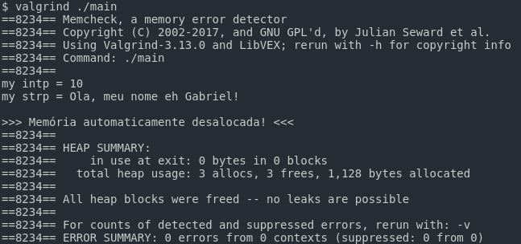

# Automatic Memory Management in C

Gerenciamento automático de memória dos objetos alocados na heap

Compile com:

```
gcc -O2 -Wall main.c auto_management.c -o main
```

Resultado do valgrind:

<small>Obs: aparentemente a função atexit também faz alocação dinâmica, por isso na imagem mostra que 3 alocações foram realizadas.</small>
